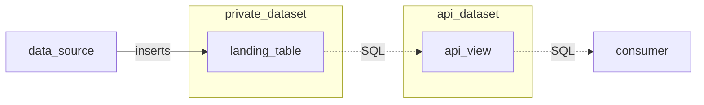

# SQL API Pattern

## Intent

Provide a stable, evolvable interface to relational data stored in a data warehouse.

## Problem

Raw data is stored in tables in the data warehouse.
These tables consist of typed columns defined by the table schema.

Changes to the table schema such as dropping columns or changing the type of a column will cause failures in queries referencing those columns.

### Example

Consider this table.

|receipt_timestamp (TIMESTAMP)|id (STRING)|succeeded (INT)|
|-|-|-|
|2022-01-01 12:34:56.789|"384764"|1|
|2022-01-01 23:45:50.123|"246743"|0|

The data source populating this table changes so that the `succeeded` column is a boolean value.
How can we make this new data available to consumers without co-ordinated changes?
Specifically:
- without breaking existing consumer queries?
- without changing the data pipeline that populates the table?

## Solution

- hide implementation details: place the table in which the raw data lands into a private dataset
- provide an "API": a SQL view that defines a robust SQL-level "contract" in a different dataset that consumers may query
- grant access for the API view to query the implementation details

## Data Flow



## Example

From an initial position as follows:

`private_dataset.landing_table`

|receipt_timestamp (TIMESTAMP)|id (STRING)|succeeded (INT)|
|-|-|-|
|2022-01-01 12:34:56|"384764"|1|
|2022-01-01 23:45:50|"246743"|0|

`api_dataset.api_view`

```SQL
SELECT
  *
FROM `private_dataset.landing_table`
```

Contract Schema/API:

|receipt_timestamp (TIMESTAMP)|id (STRING)|succeeded (INT)|
|-|-|-|
|2022-01-01 12:34:56|"384764"|1|
|2022-01-01 23:45:50|"246743"|0|

-----

Change: source needs to send succeeded as BOOLEAN - add column, non-breaking change

`private_dataset.landing_table`

|receipt_timestamp (TIMESTAMP)|id (STRING)|succeeded (INT)|succeeded_bool (BOOL)|
|-|-|-|-|
|2022-01-01 12:34:56|"384764"|1|null|
|2022-01-01 23:45:50|"246743"|0|null|
|2022-01-02 13:45:56|"246743"|null|TRUE|

`api_dataset.api_view`

```SQL
SELECT
  receipt_timestamp,
  id,
  COALESCE(succeeded, IF(succeeded_bool, 1, 0)) succeeded
FROM `private_dataset.landing_table`
```

|receipt_timestamp (TIMESTAMP)|id (STRING)|succeeded (INT)|
|-|-|-|
|2022-01-01 12:34:56|"384764"|1|
|2022-01-01 23:45:50|"246743"|0|
|2022-01-02 13:45:56|"246743"|1|


## Checklist

